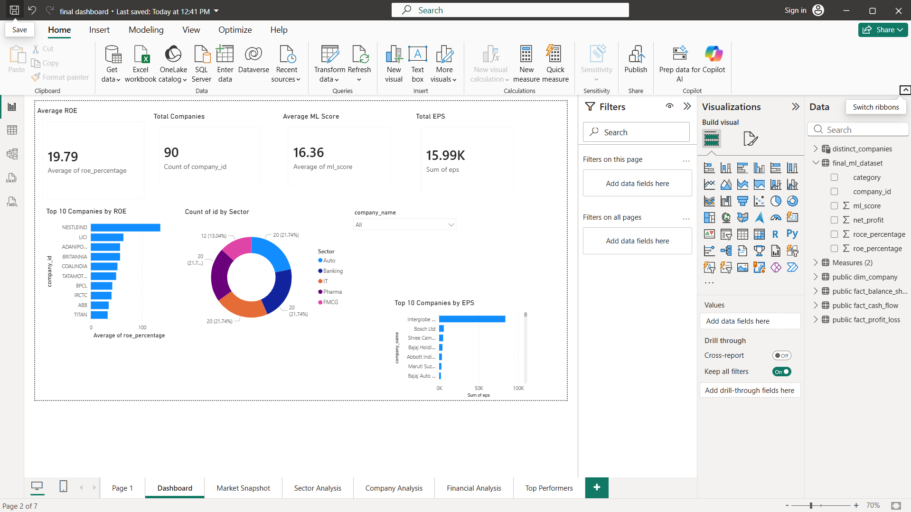

# Stock Analytics Dashboard

## Overview

A Stock Analytics Dashboard built using Python, Machine Learning, Power BI, and Financial Data Analysis techniques. The project collects, cleans, transforms, and analyzes stock market data to generate business insights and interactive dashboards.

## Features

* Financial data preprocessing and cleaning
* Exploratory Data Analysis (EDA)
* Machine Learning scoring model
* Power BI dashboard visualizations
* Sector-wise and company-wise analysis
* Profitability and performance tracking

## Tech Stack

* Python
* Pandas
* NumPy
* Matplotlib
* Seaborn
* Jupyter Notebook
* Power BI
* Git & GitHub

## Project Structure

data_raw/ - Raw datasets

data_clean/ - Cleaned datasets

etl/ - Extraction, Transformation and ML notebooks

pBI/ - Power BI dashboard files

screenshots/ - Dashboard screenshots

## Dashboard Pages

* Dashboard Overview
* Market Snapshot
* Sector Analysis
* Company Analysis
* Financial Analysis
* Top Performers

## Screenshots

### Dashboard

### Market Snapshot

### Sector Analysis

### Company Analysis

### Financial Analysis

### Top Performers

## Author

Srujan Anirudh
